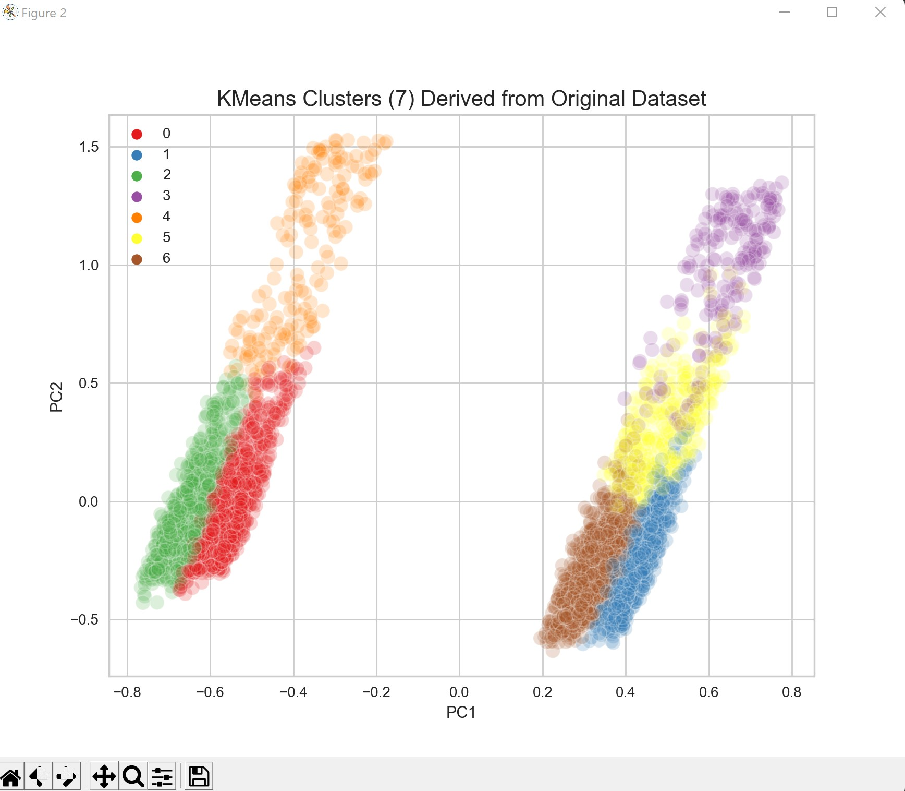

## Overview

This repository is for the source code of **Mixerify**, a machine learning model which analyzes a playlist of your choice and returns a 50 song playlist from the top new songs of the last two years among all relevant genres using Spotify. The playlist is generated based on your taste/ input playlist.

**[CLICK HERE TO GENERATE A PLAYLIST](http://mixerify.ml) :)** 

**Here is a demo of how the website works:**

---

### Content

### **Algorithms of the model**

The algorithms used to create the song recommendation system are:

1. K Means Clustering
2. K Nearest Neighbors

The model uses K Means to create ratio of songs with similar Means of features and KNN to find the nearest song in each cluster from a big dataset of new songs of all the genres. This process is done using ratios of song in each cluster and the recommended playlist includes 50 songs.

### **Data cleaning and dataset creation process**

Spotify’s API called [Spotipy](https://spotipy.readthedocs.io/en/2.19.0/), allows you to search for features of a song. 

We initially created an API for our model to iterate through the entered playlist of the user and extract the IDs of all the songs. Then, we created functions to receive the 13 features of every single song that the API allows us to have. Finally, we used the machine learning algorithms to analyze the user data and create a final dataset namely the final playlist.

### **Overview of the machine learning progress and graphs**

The machine learning process was mainly using the Scikit-learn functions and plotting the results using Seaborn and Plotly. An instance of a graph generated from the main dataset of songs that we recommend songs from can be seen below:

Used KMeans model and plotly to generate the plot.

To choose the final songs, we used KNN model from Scikit-learn to iterate through all user songs and find the nearest neighbors to each song from each cluster. After comparing the distances, the final dataset/playlist is generated. 

### Website creation

The front end is built in React.js and styled with Tailwind. We take advantage of several React libraries including spotify-web-api-js for Spotify API calls and Axios for REST calls. The backend handles authentication using Spotify OAuth and uses Express.js to set up REST endpoints to run the machine learning Python scripts.

---

### To find out more about the code:
1. For the development progress check:
[MIXERIFY_PROGRESS](https://github.com/EMZEDI/Mixerify/blob/b0d0bac1a9017613aeff61d83d1ac6584e33a444/PyPackage/LM.ipynb)
and
[MIXERIFY_TEST](https://github.com/EMZEDI/Mixerify/blob/b0d0bac1a9017613aeff61d83d1ac6584e33a444/PyPackage/MSE.ipynb)

2. For our data cleaning and analysis API which uses Spotipy you can refer to:
[MIXERIFY_API](https://github.com/EMZEDI/Mixerify/blob/b0d0bac1a9017613aeff61d83d1ac6584e33a444/PyPackage/IOLib_improved.py)

3. For Backend and Frontend sourcecode:
[MIXERIFY_WEB](https://github.com/EMZEDI/Mixerify/tree/main/WEB_DIR)

---

## Contributors
**Shahrad**: Data Cleaning, Machine learning developer and testing

**Emma**: Data Cleaning, Machine learning developer and testing

**Hanna**: Data Cleaning, Machine Learning developer and testing 

**Tristan**: Full Stack Web Development and testing

---

